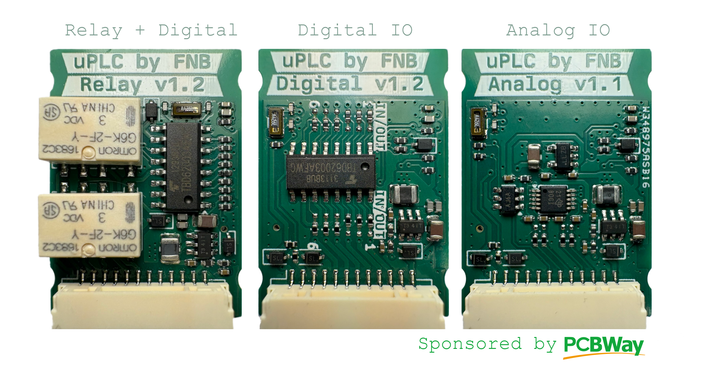
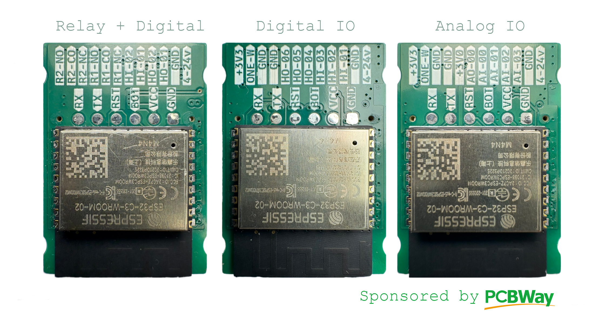
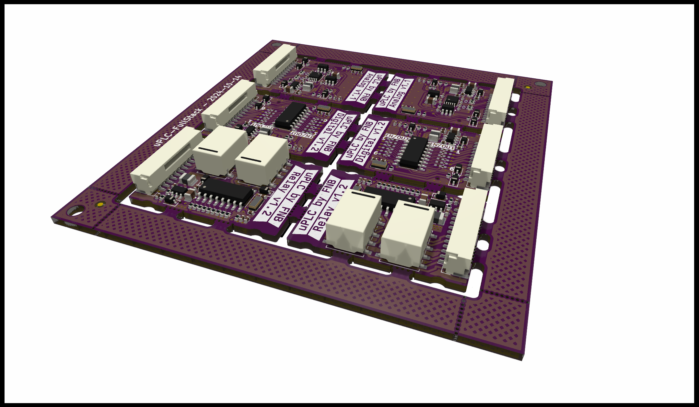
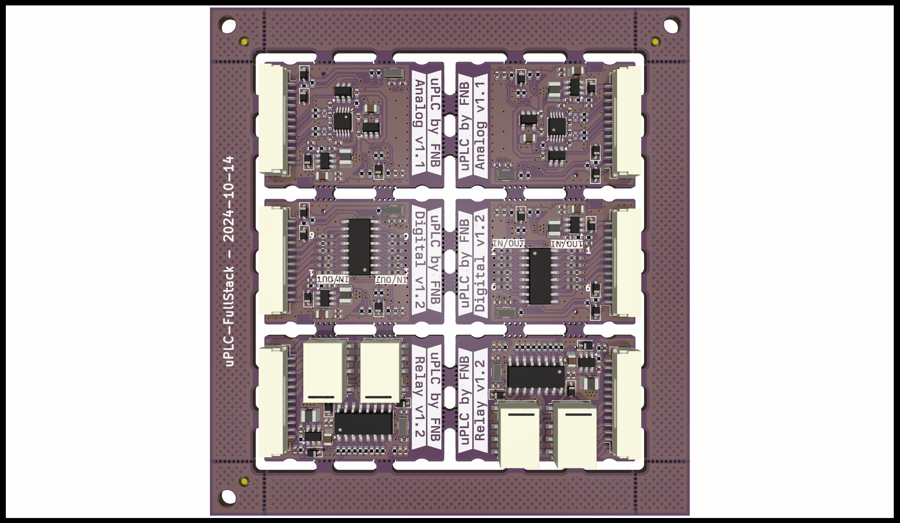
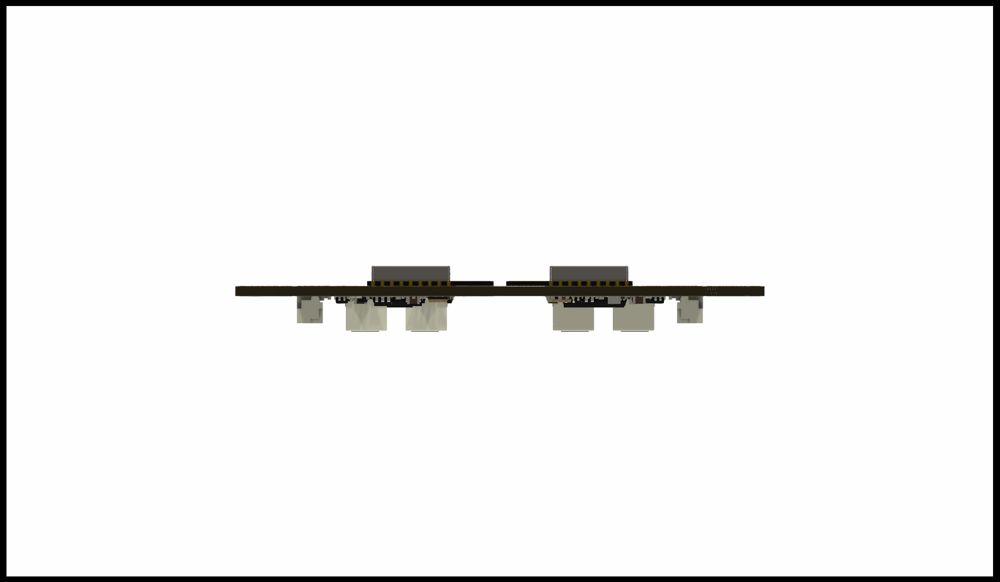
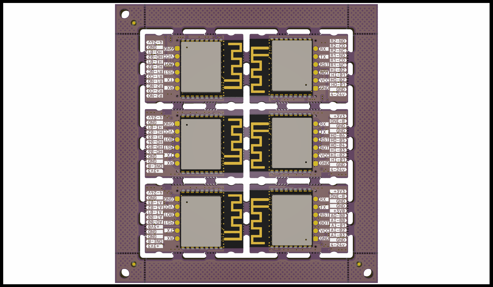

# uPLC - Miniaturized Distributed Monitoring and Control (BT/WiFi)
## PcbWay Sponsorship
Thanks so much to PCBWay for sponsoring my first assembly run for this project, they deliver awesome quality as allways with 6 perfectly soldered prototypes delivered fully assembled at my door in less than 2 weeks from ordering. Look at this beautiful trio of boards ready for automating every dumb device in my house thanks to PCBWay. ESP-Home code examples are comming soon.

The uPLC (Universal Programmable Logic Controller) is a compact (22x32mm) I/O controller powered by the ESP32, designed to automate various tasks around you. So far, three versions have been developed. All versions are generally 24V-tolerant for digital I/O, except for the analog inputs, and feature a wide-range 3.8-24V buck regulator for power input.

The primary purpose of the uPLC is to "smartify" devices by integrating them with [ESPHome](https://esphome.io/). But it can also function as a direct, point-to-point PLC, using **ESP-NOW** for wireless communication, replacing traditional wired connections at a cost of latency. 

## Available Versions:
- **[uPLC-Digital](https://github.com/fredriknk/uPLC-digital):** High-speed digital I/O
- **[uPLC-Relay](https://github.com/fredriknk/uPLC-relay):** Relays and digital I/O
- **[uPLC-Analog](https://github.com/fredriknk/uPLC-Analog):** ADC and DAC

### Coming Soon:
- **uPLC-COMM:** For sensor connections- SPI, I2C, SDI12 support
- **uPLC-4_20:** Current loop for industrial sensors
- **uPLC-TBD:** If you have a good idea give me a message or issue 

## Specifications

| **Parameter**   | **Description**                                                     |
|-----------------|---------------------------------------------------------------------|
| **Input Voltage** | 3.8-24V                                                           |
| **Current Consumption**  | TBD: WiFi Active: ##mA, Radio Off: ##mA, Deep Sleep: ##uA  |  
| **Communication** | 2.4GHz Wi-Fi, UART (TTL level)                                    |
| **Baud Rate**    | 115200                                                             |
| **PCB Size**     | 22 x 31.1 mm                                                       |
| **PCB Material** | 1.6mm FR4, HASL lead-free, 4-layer                                 |
| **Case Size**    | X x X x X mm (TBD)                                                 |

## uPLC-Stack:
To facilitate manufacturing and development, I've created a panelized version using **KiKit** scripting. The uPLC-Stack includes two units of each version, making it easier to assemble and test multiple variants in one go. Im planning on

### Running the Panelization Script:
To use the panelization script, clone all the uPLC repositories and organize them in a directory one level back from the uPLC-Stack folder. This allows the KiKit script to automatically pull in all required files for panelizing.

### Stack Images

- **Perspective View**  
  
  
- **Top View**  
  

- **Side View**  
  

- **Bottom View**  
  
